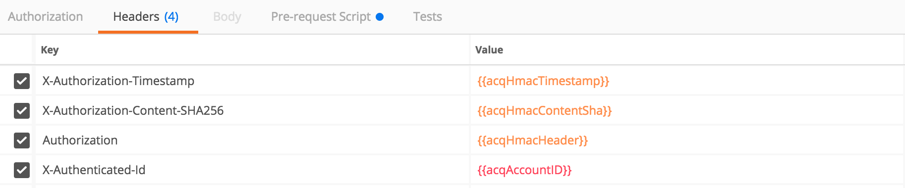

# Description
This is a prescript for the standalone version of postman to calculate HMAC signatures for accessing HMAC protected API's

# Getting Started

1. Download the standalone version of postman https://www.getpostman.com
1. Copy [prerequestscript.js](src/prerequestscript.js) into postman Pre-request Script

1. Add your public and secret keys to the variables at the top of the script

1. Add the following headers to the Headers tab
  ```
  Authorization:{{acqHmacHeader}}
  X-Authorization-Timestamp:{{acqHmacTimestamp}}
  X-Authorization-Content-SHA256:{{acqHmacContentSha}}
  X-Authenticated-Id: {{acqAccountID}}
  ```
  
The resulting headers tab should look like this.



# Contributing

Contributions to the project are most welcome, so feel free to fork and improve. When submitting a pull request, please try and follow a consistent coding style. The http-hmac-javascript portion of this script be kept in sync with the http-hmac-javascript SDK any changes should be submitted first to the http-hmac-javascript lib then merged here.

More Detailed Instructions can be found in [CONTRIBUTING.md](CONTRIBUTING.md)